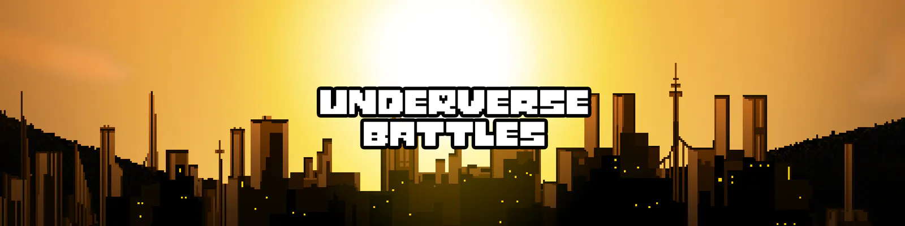

### What this?
MMO BulletHell game based on Underatale, made by GameMaker Studio 2 and NodeJS(TypeScript)

## Building
All stable version available for download in [Releases](https://github.com/UnderverseBattles/underverse-battles/releases)

### Client - Android or Windows x64
- Download GameMaker Studio 2
- Open `client/UnderverseBattles.yyp`
- Set project config (`development` for testing or `Default` for release)
- Run compilation `f5`

### Server
- Download NodeJS 16+
- Open `server` folder
- Install dependencies `npm install`
- Compile project `npm run build`
- Run server (`npm run development` for testing or `npm run production` for release)