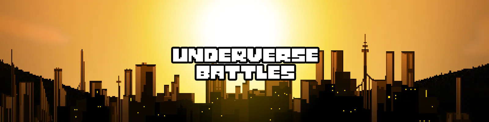

## What is this?
UnderverseBattles game server written in [TypeScript](https://www.typescriptlang.org/) based on [Warp](https://github.com/evolutionleo/Warp) framework

## How do I run this?
- Install [NodeJs](https://nodejs.org/en/download/)

Well, first you'll need to compile the TypeScript code to JavaScript.
np
- Run `npm install` to install all the dependencies
- Run `npx tsc` to compile the whole project or `npx tsc -w` to start the compiler in watch mode
- After that, just run the server `npm run development` for development or `npm run production` for production.
